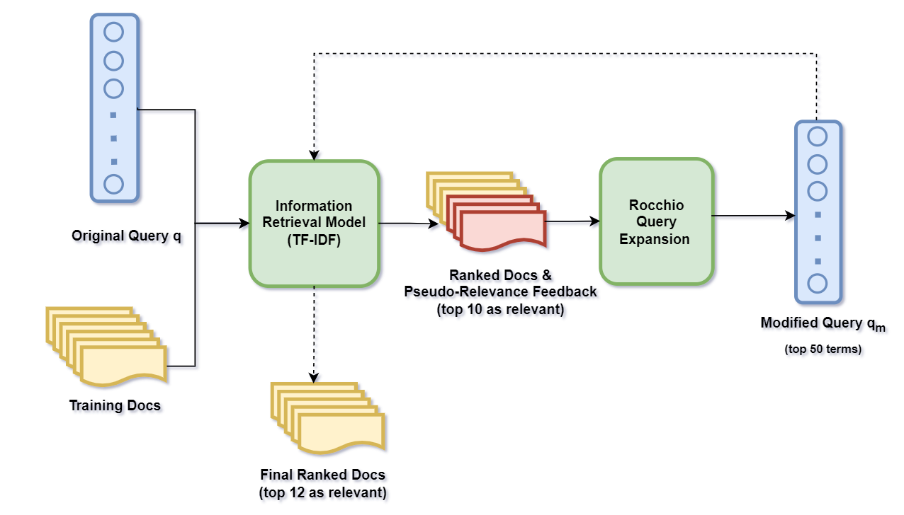
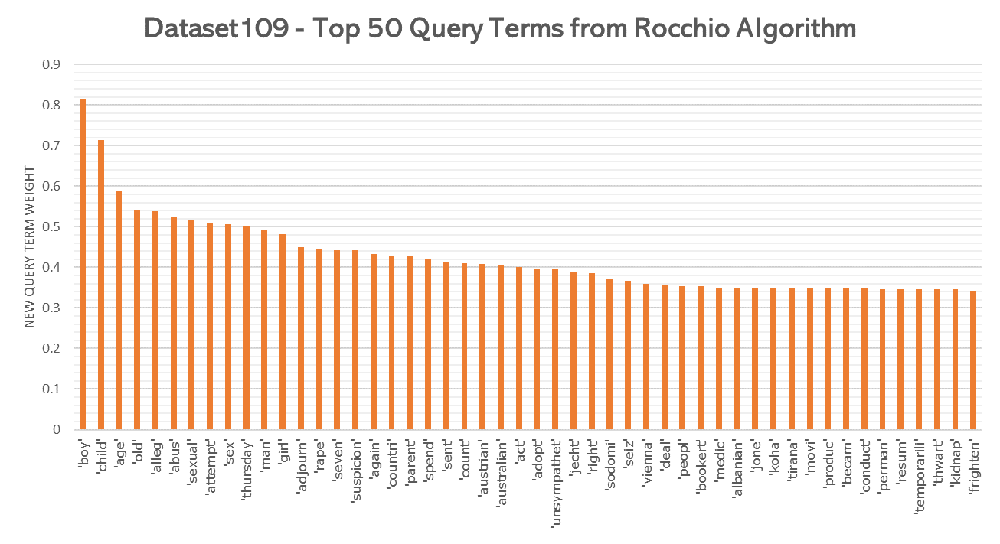

# Evaluating the Effectiveness of Document Retrieval Models

With the rapid expansion of the internet and search systems, the role of search engines has become essential. This project aims to evaluate the performance of the **Best Match 25 (BM25)** model using 50 datasets, each containing 50 queries. Additionally, two alternative models, **Rocchio Query Expansion TF-IDF** model (my_model1) and **Pseudo-relevance Feedback** model (my_model2), were designed to rank documents within each dataset by leveraging pseudo-relevance feedback for improved retrieval performance. To assess the effectiveness of these models, three evaluation metrics were used: **Average Precision (AP), Precision@12, and Discounted Cumulative Gain (DCG) at rank 12**. A comparative analysis was conducted using a t-test in Excel. The results demonstrated that both my_model1 and my_model2 outperformed the baseline BM25 model. Amongst the three, my_model1, based on the Rocchio algorithm, achieved the highest performance.

## Data Collection

- **DataSets**  – includes 50 Datasets (folders “dataset101” to “dataset150”) for query R101 to query R150.
- **Queries.txt** – contains definitions for 50 queries (numbered from R101 to R150) for 50 datasets in the data collection, where each `<top>` element (`<top>`...`</top>`) defines a query (topic), including query number (`<num>`), title (`<title>`), description (`<desc>`) and narrative (`<narr>`).
- **Feedback** - includes relevance judgements (file “dataset101.txt” to file “dataset150.txt”) for all documents used in the 50 datasets, where "1" in the third column of each .txt file indicates that the document (the second column) is relevant to the corresponding query (the first column); and “0” means the document is non-relevant.

## Data Structures

In the code implementation, each document and query is represented as an object of the `BowDoc` and `BowQuery` classes respectively. Each object consists of a `terms` attribute which is a Bag-of-Words representation of terms with their frequencies in a dictionary data structure. Each dataset is a collection of documents, represented as a `BowColl` class with its specific ID corresponding to the query ID. For this implementation, all the class attributes are assumed to be private, meaning no direct access can be made using the dot operator references; instead, all access is done using getter and setter functions constructed for each attribute.

All class attributes of each class are summarized as below:

| Classes    | Class Attributes    | 
|--------------|--------------|
|BowDoc| `docid`: document id   `terms`: {term: frequency,...} dictionary   `doc_len`: document length, the number of words appeared in the document |
|BowColl| `docs`: {docid: BowDoc,...} dictionary   `doc_freq`: {term: document frequency,...} dictionary   `cum_tf`: {term: cumulative term frequency,...} dictionary   `avg_doc_len`: average document length across all documents in the collection   `total_doc_len`: total document length of all documents|
|BowQuery| `id`: query id   `terms`: {query term: frequency,...} dictionary|
|QueryColl| `queries`: {queryid: BowQuery,...} dictionary |

## Parsing of Documents and Queries 

Contained in the `utli.py` are two functions for parsing query and documents, which carried out the following parsing procedures and instantiate the document and query objects using the `BowDoc` and `BowQuery` classes.

1. ***Document Parsing***: `<text>`...`</text>` part of the document is considered for the tokenization with all the tags,punctuations, stop words and words with fewer than three characters excluded from tokenization. Stopword is based on **“common-english-words.txt”** and the term is stemmed using the porter2 library.

2. ***Query Parsing***: Similar parsing procedure has been employed to parse query term. The parser only considers the `<title>` for tokenization, along with the removal of stop words, tags, spaces and punctuations and word stemming. Similarly, only terms with at least 3 characters are added to the query term list.

## Model Architecture and Descriptions

### 1. BM25 (Best Match 25) Information Retrieval (IR) Model

BM25 is a term-based ranking model that considers term frequency (TF), document length and average document length in ranking document relevance to a given query. It is a popular and effective ranking algorithm based on binary independence model, and is widely used in modern search engines. The ranking formula can be defined as follows:

$$
    \sum_{i \in Q} \log \frac{(r_i + 0.5) / (R - r_i + 0.5)}{(n_i - r_i + 0.5) / (N - n_i - R + r_i + 0.5)} 
    \cdot \frac{(k_1 + 1) f_i}{K + f_i} 
    \cdot \frac{(k_2 + 1) q f_i}{k_2 + q f_i}
$$

where $Q$ is the title of the long query, $k_1$ = 1.2, $k_2$ = 500, $b$ = 0.75, $K$ = $k_1*((1-b) + b*dl /avdl)$, $dl$ is document d’s length and $avdl$ is the average length of a document in the dataset, $qf$ as the query term frequency, $f$ is the term frequency. The base of the log function is 10.
        

### 2. Rocchio Query Expansion TF-IDF Retrieval Model

With an aim to enhance the performance of information retrieval, the Rocchio Algorithm, a query expansion technique, is employed to modify and expand the initial queries based on pseudo-relevance feedback. After analyzing the query components provided in queries.txt, it was determined that the query title encapsulates the most important and meaningful information. While the description defines relevance and irrelevance, it poses a challenge to identify which sentences should be included in the query term indexing. Since the queries are relatively short, query reformulation through expansion can be beneficial. This process involves augmenting the original query with new terms and eliminating noisy terms based on the top-ranked documents obtained from the pseudo-relevance feedback, resulting in a collection of highly informative terms.

**Key steps performed in the Rocchio model:**

1. Calculate document relevance score using **TF-IDF** IR model with term weight normalization (**First-Pass Retrieval**).
2. Create pseudo-relevance feedback and term vocabulary based on relevant document set (top-10 documents).
3. Perform Rocchio query expansion and get the expanded query using the top 50 terms of the highest average weights.

    $$
    q'_j = \alpha \cdot q_j + \beta \cdot \frac{1}{|Rel|} \sum_{D_i \in Rel} d_{ij} - \gamma \cdot \frac{1}{|Nonrel|} \sum_{D_i \in Nonrel} d_{ij}
    $$
    
    where $d_{ij}$ is the TF-IDF weight of term $j$ in document $i$, $Rel$ is the relevant documents, $Nonrel$ is the non-relevant documents.
4. Re-run the TF-IDF IR model with the new query terms and weights (**Second-Pass Retrieval**).
5. Label the top 12 documents as relevant (`1`) and remaining as non-relevant (`0`) (**Document Retrieval**).

The chart above presents the expanded query from rocchio algorithm for the initial query vector of Dataset 109: {'child':1, 'custodi':1, 'case':1}, indicating that the relevant documents have encapsulated more important terms than the original query in fulfilling information needs, with the term ***'boy'*** being the most important while the terms ***'custodi'*** and ***'case'*** were voted out of the top 50 terms.

### 3. Pseudo-Relevance Feedback Model

Relevance feedback is a technique used to acquire user feedback on the initial output from a given query `Q`, determining whether retrieved documents are relevant to the user's information needs. Pseudo-relevance feedback, also known as blind feedback, is a variation of this method that assumes the top `'K'` ranked documents are relevant to initial query `Q`. Using the pseudo-relevance feedback, a *relevance model* can be estimated from the query `Q` and the top-k ranked documents. Finally, it uses Kullback-Leibler divergence (KL-divergence) - a well-known measure of difference between probability distributions - is used to rank new documents based on how similar its document model is to the language model.

**Key Steps:**

1. Rank documents using query likelihood model that approximates the probability that the query could be generated by the document model (i.e. same topic), with **Dirichlet Smoothing** to improve the word probability of unseen words in the collection.
2. Select top 10 relevant documents as pseudo feedback and build a language model `P(w|R)` on top of the relevant documents which estimates the probability of a word that appears in a document given it is relevant.
3. Using negative KL-divergence metric, compare document model to the estimated language model for final document ranking.

## Results

### Evaluation Metrics

| Metrics    | Baseline    | Model 1    | Model 2    | 
|--------------|--------------|--------------|--------------|
|Average Precision|0.36|0.43|**0.47**|
|Precision @ Rank 12|0.23|**0.34**|0.29|
|Discounted Cumulative Gain|1.35|**1.93**|1.86|

*The highest score for each metric is bolded.*

The table demonstrates that both devised models substantially outperform the baseline across all evaluation metrics. Model 2 achieves the highest Average Precision (0.47), while Model 1 demonstrates the most superior performance in both Precision @ Rank 12 (0.34) and Discounted Cumulative Gain (1.93), winning two out of three key performance indicators.

### Statistical Significance Analysis

To determine meaningful differences between the models, paired t-tests were conducted with an alpha $\alpha$ threshold of 0.1.

| Metrics    | Baseline vs Model 1    | Baseline vs Model 2   | Model 1 vs Model 2    | 
|--------------|--------------|--------------|--------------|
|Average Precision|**0.10**|**0.04**|0.20|
|Precision @ Rank 12|**0.001**|**0.058**|**0.059**|
|Discounted Cumulative Gain|**0.006**|**0.02**|0.35|

*P-values indicating statistical significance (≤ 0.1) are bolded.*

Based on the t-test table with alpha value of 0.1, the following conclusions can be drawn:

 1. **Baseline vs Model 1**: Model 1 significantly outperforms the Baseline across all three metrics, with particularly strong statistical evidence for improvements in Precision @ Rank 12 (p=0.001) and DCG (p=0.006). The consistently low p-values across all metrics indicate that Model 1 represents a robust and consistent performance gains over the baseline for information retrieval tasks.

2. **Baseline vs Model 2**: Model 2 demonstrates statistically significant improvements over the Baseline across all metrics, with p-values consistently below the alpha threshold of 0.1. While the improvements are clear, the statistical significance is somewhat less pronounced than that of Model 1, particularly for Precision @ Rank 12 where p=0.058 approaches the significance threshold.

3. **Model 1 vs Model 2**: There is no statistically significant difference between Model 1 and Model 2 in terms of Average Precision (p=0.20) and DCG (p=0.35), suggesting comparable overall performance. However, Model 1 shows a marginally significant advantage over Model 2 in Precision @ Rank 12 (p=0.059), indicating it may provide more relevant results within the typical viewing range that users typically examine.

## Conclusion and Remarks

In a nutshell, Model 1, Rocchio Query Expansion TF-IDF model, is concluded to be the best-performing model due to its superior performance in two of the three metrics and stronger statistical significance in improvements over the baseline. The Rocchio algorithm's effectiveness stems from its ability to dynamically expand queries by incorporating feedback from relevant documents, particularly valuable when working with limited initial query contexts. Additionally, the TF-IDF weighting mechanism enhances retrieval precision by effectively balancing term frequency with document discrimination power, resulting in more relevant document rankings across the evaluation dataset.